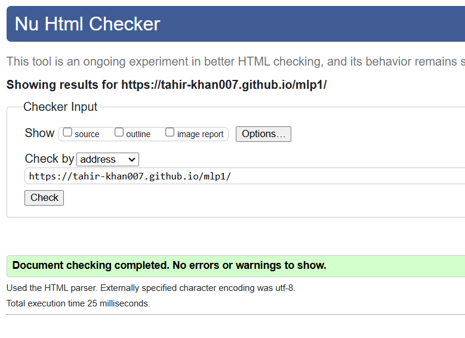
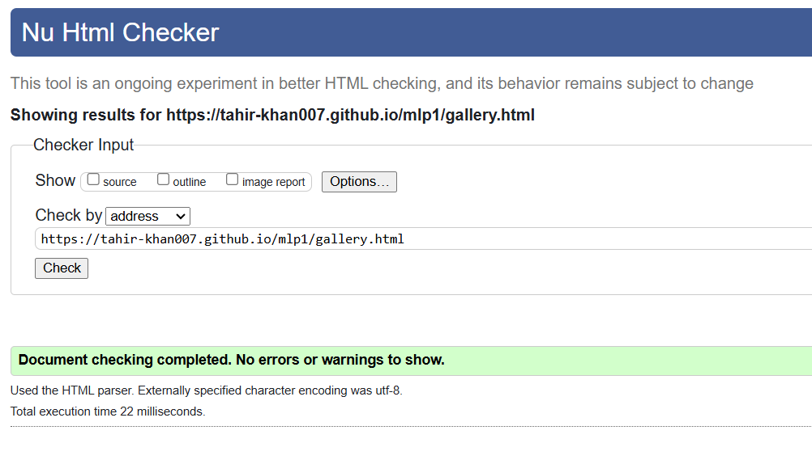
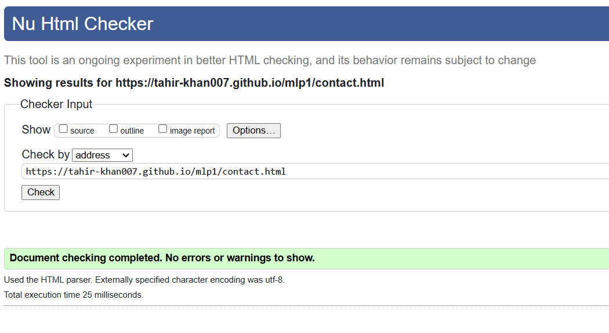

# 🌿 Green Genie Landscapes

A responsive website for a landscaping company offering garden design, paving, and artificial grass solutions, aimed at showcasing the company's services and encouraging customer inquiries and bookings.

## Code Institute - Milestone Project 1

### HTML/CSS Essentials - Users Centric, Static Front-End Website

### By Tahir Khan

[View Repository on GitHub](https://github.com/Tahir-khan007/MSP1)

[View Live Website](https://tahir-khan007.github.io/MSP1/)

## The Why

The primary goal of this website is to showcase the services offered by Green Genie Landscapes, such as garden design, paving, and artificial grass solutions. It aims to attract potential customers by displaying before and after transformations, making it easy for users to inquire about services and request quotes. The website is designed to help build a professional online presence for the company and facilitate customer bookings.

## Business Goal

+ Increase customer inquiries and bookings for services.
+ Provide a professional online presence for the company.
+ Showcase before & after transformations to attract potential clients.

## (UX) User Experience:

Users will be able to easily navigate the website to understand the services offered, view completed projects, and request quotes. The contact form is designed to make inquiries simple and quick. 

### User Stories

- #### First-time Users Goals:
  - To quickly understand the services offered.
  - To view the before & after transformations for inspiration.
  - To easily find contact details and request a quote.

- #### Returning Users Goals:
  - To use the contact form to inquire about services.
  - To follow the company on social media for updates and promotions.

## Design:

The design is modern and clean, reflecting the natural beauty and sustainability of the services provided by Green Genie Landscapes. The website uses earthy colors and a professional layout to create a welcoming and calming environment for potential clients.

### Design Brief:

+ **Color**:
  - **Green & Earth Tones**: Represent nature, growth, and sustainability.
  - **White & Grey Accents**: Give a clean, modern feel to the design.

+ **Typography**:
  - **Poppins**: Bold, modern font for headings and easy-to-read font for paragraphs.

+ **Images**:
  - **Hero Image**: A stunning outdoor space to attract users' attention.
  - **Before & After Gallery**: Showcases the company’s expertise and successful projects.

## Features

### Existing Features:

- **Navigation Bar**: Links to the Home, Gallery, and Contact pages.
- **Image Gallery**: Showcases completed landscaping projects.
- **Contact Form**: Allows customers to easily request quotes.
- **Social Media Links**: Connect with the company on Facebook, Instagram, and more.

### Future Features:
- **Online Booking System**: Allow users to schedule consultations directly.
- **Testimonials Section**: Display reviews from satisfied clients.

## Technologies:

### Languages used:
- [HTML5](https://en.wikipedia.org/wiki/HTML5)
- [CSS3](https://en.wikipedia.org/wiki/CSS)

### Other tools:
- [Bootstrap](https://en.wikipedia.org/wiki/Bootstrap_(front-end_framework)): Used for responsive design and layout.
- [Font Awesome](https://fontawesome.com/v4.7/icons/): Used for icons, including social media links.

## Testing:

### Testing Results:

#### HTML Testing:
- **Homepage Testing Results**:
  

- **Gallery Page Testing Results**:
  

- **Contact Page Testing Results**:
  

#### Validation Tests:

- **HTML Validation**: Passed W3C validation.
  - **Homepage**:
    
  - **Gallery Page**:
    
  - **Contact Page**:
    

- **CSS Validation**: No major errors found.
  - **Homepage**:
    
  - **Gallery Page**:
    
  - **Contact Page**:
    

## Challenges & Learning:

- **Font Awesome Icons Issue**: The social media icons were initially too large due to the fa-xl class. The issue was resolved by manually adjusting the CSS styling, with help from a colleague.
- **Contact Form Alignment**: Spent time ensuring that the form was properly aligned and responsive across different screen sizes.

## Future Enhancements:

- 🚀 **Improve SEO**: Optimize metadata for better Google ranking.
- 🚀 **Add Client Testimonials**: Display real customer reviews to enhance trust.
- 🚀 **Enhance Animations**: Use subtle hover effects for a smoother user experience.
- 🚀 **Integrate Booking System**: Allow users to schedule consultations directly from the site.

## Deployment:

###  Version Control & Deployment
      Developed using Git, GitHub & VS Code.
      Hosted on GitHub Pages.

### Cloning Repository Locally:
- Clone the repository using the following command:
git clone https://github.com/tahir-khan007/ms1.git

### Forking Repository:
1. Log in to GitHub and locate the repository.
2. Click the **Fork** button at the top-right.
3. This will create a copy of the project in your GitHub account.

## Credits:

### Acknowledgements:
A huge thank you to my mentor and the Code Institute tutors for their guidance and support throughout the project.

### Resources:
- [W3Schools](https://www.w3schools.com/)
- [MDN Docs](https://developer.mozilla.org/)
- [Bootstrap Documentation](https://getbootstrap.com/docs/5.0/)
- [Font Awesome](https://fontawesome.com/)
- [Image Sources: Google Images, Instagram, Unsplash](https://unsplash.com/)
