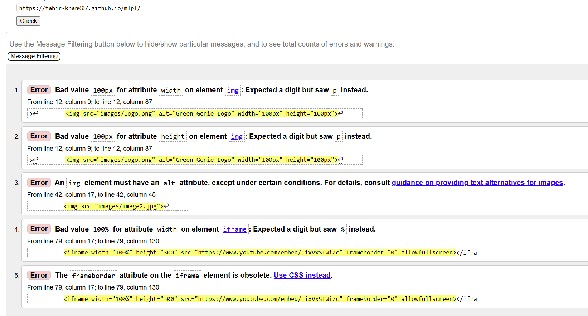
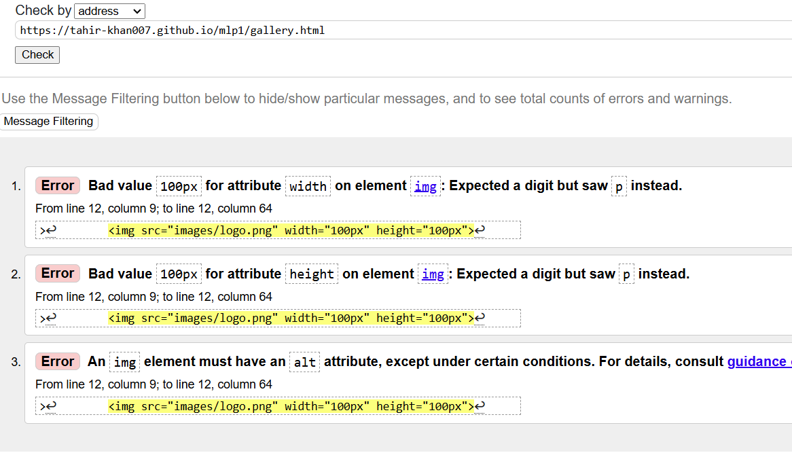
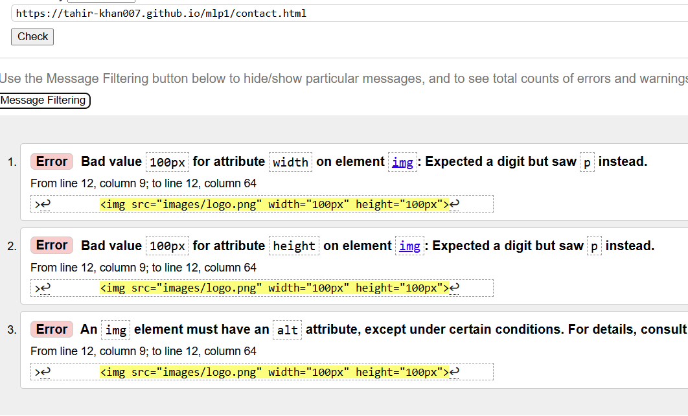
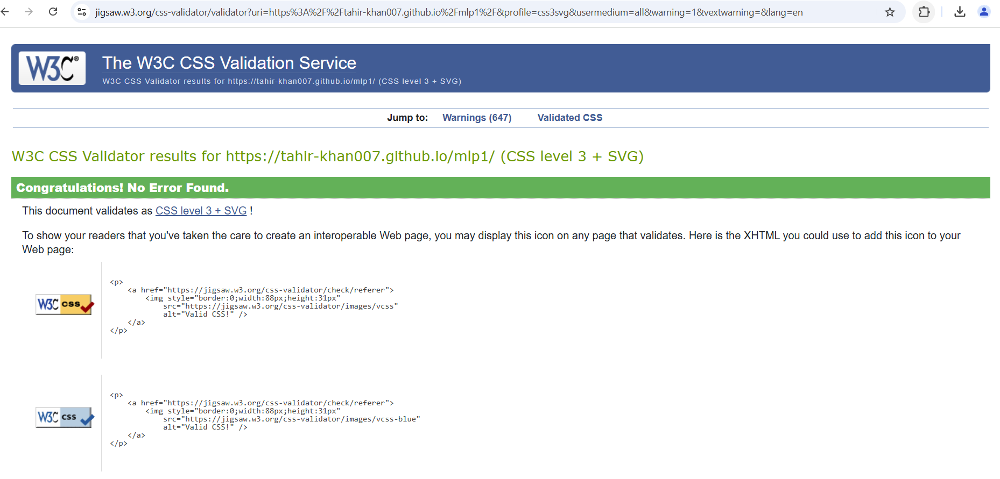
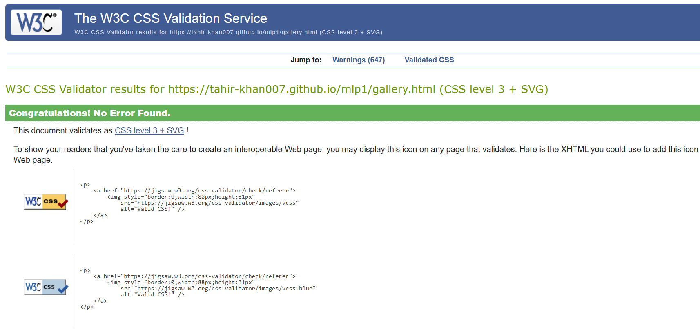
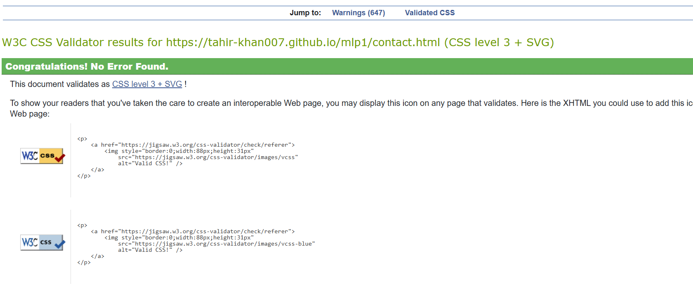

🌿 Green Genie Landscapes
A responsive website for a landscaping company offering garden design, paving, and artificial grass solutions.
🔗 Live Website: (https://tahir-khan007.github.io/mlp1/)
🔗 GitHub Repository: (https://github.com/Tahir-khan007/mlp1)

📌 Project Overview
Green Genie Landscapes is a modern, user-friendly website designed to showcase the company’s services, including:
✅ Custom Garden Design – Tailored outdoor spaces for clients.
✅ Porcelain Paving – Durable and stylish paving solutions.
✅ Artificial Grass – Low-maintenance greenery for all seasons.
✅ Before & After Transformations – Showcasing completed projects.
✅ Easy Contact Form – Quick inquiries and quote requests.

🎯 Business Goals
🔹 Increase customer inquiries and bookings for services.
🔹 Provide a professional online presence for the company.
🔹 Showcase before & after transformations to attract potential clients.

👥 User Experience (UX)

🎯 User Stories
👤 First-Time Visitors
    Quickly understand the services offered.
    View the before & after video for inspiration.
    Easily find contact details & request a quote.
🔄 Returning Users
    Use the contact form to inquire about services.
    Follow the company on social media for updates.

<!-- 🏗 Wireframes (W3R)
The website’s structure was planned using wireframes to ensure a clear and effective user experience. The wireframes were created using Balsamiq.
Device
Wireframe
Desktop
(Replace with actual wireframe image)
Tablet
(Replace with actual wireframe image)
Mobile
(Replace with actual wireframe image)
📄 View Full Wireframe Document: Download PDF -->

🎨 Design Choices

🌈 Color Scheme
Green & Earth Tones: Represent nature, growth, and sustainability.
White & Grey Accents: Give a clean and modern feel.

🖋 Typography
Poppins Font for Headings and Paragraphs
Headings: A bold, modern font for clarity.
Paragraphs: A simple, easy-to-read font for accessibility.

🖼 Images
Hero Image: A stunning outdoor space to attract users' attention.
Before & After Gallery: Demonstrates the company’s expertise.

🏗 Features
✅ Navigation Bar – Clear links to Home, Gallery, and Contact pages.
✅ Image Gallery – Showcases completed landscaping projects.
✅ Contact Form – Allows customers to request quotes easily.
✅ Social Media Links – Enables users to connect on platforms like Facebook & Instagram.

🔮 Future Features:
Online Booking System – Allow users to schedule consultations.
Testimonials Section – Show reviews from satisfied clients.

🛠 Technologies Used
HTML5 – Page structure.
CSS3 – Styling and layout.
Bootstrap – Responsive design.
Font Awesome – Icons for social media links.

🛠 Development & Deployment
🔹 Version Control & Deployment
        Developed using Git & GitHub.
        Hosted on GitHub Pages.

🔹 Clone This Repository Locally
        git clone https://github.com/tahir-khan007/mlp1.git

🔹 Forking This Repository
        Log into GitHub.
        Locate the repository and click Fork at the top right.
        You now have a copy of the project in your GitHub account.

🧪 Testing
    Html Homepage testing results
    
    Html Gallery Page Testing results
    
    Html Contact Page Testing Results
    
✅ Validation Tests
HTML – Passed W3C validation.
    Homepage

    Gallery Page

    Contact Page

CSS – No major errors found.
    For Home Page
    
    For Gallery Page
    
    For Contact Page
    

🏆 Challenges & Learning
🔹 Font Awesome Social Links Issue: Initially, the Font Awesome icons were too large when using the fa-xl class. My nephew helped troubleshoot the issue by adjusting the CSS styling manually.
🔹 Contact Form Alignment: Ensured proper spacing & responsiveness for different screen sizes.

📌 Future Enhancements
    🚀 Improve SEO – Optimize metadata for better Google ranking.
    🚀 Add Client Testimonials – Display real customer reviews.
    🚀 Enhance Animations – Use subtle hover effects for a smoother experience.
    🚀 Integrate a Booking System – Allow clients to schedule consultations online.

🤝 Credits & Acknowledgments
📚 Online Resources: W3Schools, MDN Docs, Bootstrap Documentation.
🎨 Image Sources: Google.